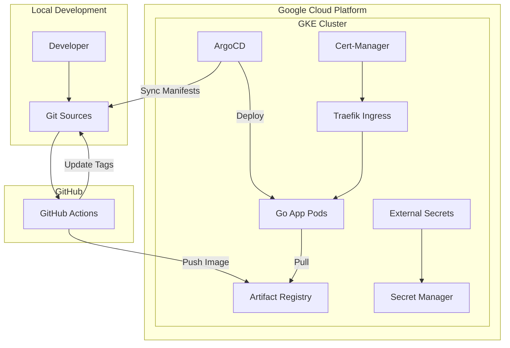

# Project Zenith-X 🚀

Zenith-X is a robust GitOps-driven cloud infrastructure project on Google Cloud Platform (GCP). It automates the deployment of a Golang application into a Google Kubernetes Engine (GKE) cluster using ArgoCD and GitHub Actions.

## 🏗 Architecture



## 🛠 Tech Stack

- **Cloud:** Google Cloud Platform (GCP)
- **IaC:** Terraform
- **Orchestration:** GKE (Standard Cluster, Spot Nodes)
- **GitOps:** ArgoCD
- **Ingress:** Traefik
- **SSL:** Cert-Manager (Let's Encrypt)
- **CI/CD:** GitHub Actions (with Workload Identity Federation)
- **App:** Golang (chi router, Docker Multi-stage)

## 🚀 Step-by-Step Guide

### 1. Prerequisites
- Google Cloud SDK (`gcloud`) installed and authenticated.
- Terraform installed.
- Helm installed.
- Access to a GitHub repository.

### 2. Infrastructure Setup (Terraform)
Navigate to the terraform directory and provision the resources:
```bash
cd terraform
# Initialize and apply
terraform init
terraform apply
```
*Note: This will create the VPC, GKE cluster, Artifact Registry, Service Accounts, and WIF Pool.*

### 3. Connect to GKE
Update your kubeconfig to point to the new cluster:
```bash
gcloud container clusters get-credentials zenith-x-cluster-testing --region asia-southeast2
```

### 4. Install ArgoCD
Install ArgoCD using Helm and apply the bootstrap configuration:
```bash
# Add ArgoCD Helm Repo
helm repo add argo https://argoproj.github.io/argo-helm
helm repo update

# Install ArgoCD
kubectl create namespace argocd
helm install argocd argo/argo-cd --namespace argocd --set server.service.type=ClusterIP --set configs.params."server.insecure"=true --wait

# Apply Root Application (GitOps Bootstrap)
kubectl apply -f argocd-bootstrap/root-app.yaml
```

### 5. CI/CD & WIF Configuration
Setup GitHub Secrets for Workload Identity Federation:
1. Go to your GitHub Repository -> Settings -> Secrets and variables -> Actions.
2. Add the following secrets (get values from Terraform outputs or gcloud):
   - `WIF_PROVIDER`: The full resource name of the WIF provider.
   - `WIF_SERVICE_ACCOUNT`: The service account email managed by WIF.

### 6. Verify Deployment
Once secrets are set, push a change to the `app/` directory. GitHub Actions will build the image, push it to GAR, and update the k8s manifests. ArgoCD will then sync the changes.
```bash
# Access ArgoCD UI
kubectl port-forward service/argocd-server -n argocd 8080:443
# URL: https://localhost:8080 | User: admin
```
To get the ArgoCD admin password:
```bash
kubectl -n argocd get secret argocd-initial-admin-secret -o jsonpath="{.data.password}" | base64 -d
```

## 🗑 Cleanup (Deleting Resources)

To avoid incurring costs, ensure you destroy the laboratory environment when finished:

### 1. Delete Kubernetes Resources (via ArgoCD or kubectl)
It's cleaner to let ArgoCD delete its managed resources first, or simply proceed to terraform destroy.

### 2. Destroy Infrastructure
```bash
cd terraform
terraform destroy
```
*Warning: This will delete the GKE cluster, VPC, and all associated data in the lab.*

## 📁 Project Structure
```text
.
├── .github/workflows/   # CI/CD Pipeline
├── app/                 # Golang Application & Dockerfile
├── argocd-bootstrap/    # ArgoCD Apps & Configs
├── k8s-manifests/       # K8s Bases & Overlays (Kustomize)
└── terraform/           # GCP Infrastructure
```

## 🔗 Endpoints
- **App:** `https://masmasdeploy.my.id` (Requires DNS point to Traefik LoadBalancer IP)
- **Health:** `/health`

---
Managed by **Antigravity AI**
